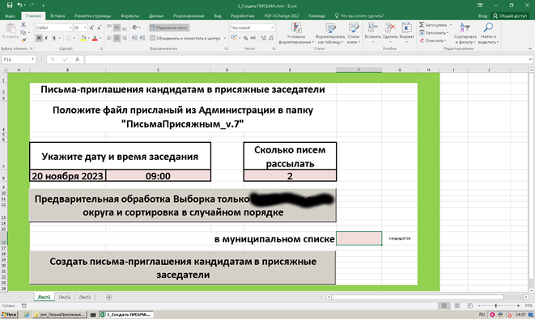
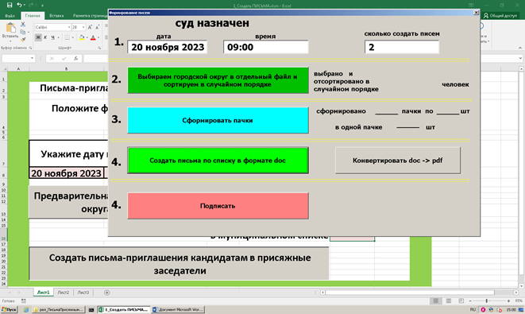
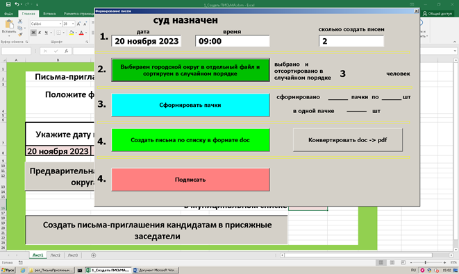

Рассылка через otpravka.pochta.ru

Для тех кто занимается массовой отправкой писем через сервис otpravka.pochta.ru.
Например для рассылки большого числа приглашений или каких то уведомлений.
Исходный список адресатов  кому надо рассылать письма в Excele файле.
Шаблон письма
Также формируется стандартный реестр для otpravka.pochta.ru

  Очень удобно использовать для рассылки писем-приглашений кандидатам в присяжные заседатели,
рассылку надо делать по несколько тысяч адресатам, выбирать в случайном порядке из несколько
десятков тысяч, и плюс к этому чтобы каждое письмо было индивудуальное с адресом и Ф.И.О.
да и еще в PDF-формате по размеру A4 которое пройдет проверку на формат при проверке otpravka.pochta.ru
  Все это работает, список 25000 выбирает 2500 кандидатов и формирует пачки по 250 pdf-ных файлов 
с Excel-реестром в каждой пачке,   

Открываем файл 1_Создать ПИСЬМА.xlsm
#
 
#
 нажимаем кнопку "Предварительная обработка ...." и в поле F:16 увидим сколько строк в исходном файле списке
 #
  
#
 затем
#
  
#

  Проект является разработкой на VBA в Excele и часть в Worde (конвертация в pdf).
Расписывать исходный код скрипта VBA мне кажется излишним, 
кто заинтересуется откроет посмотрит подправит под свои реалии.
  
